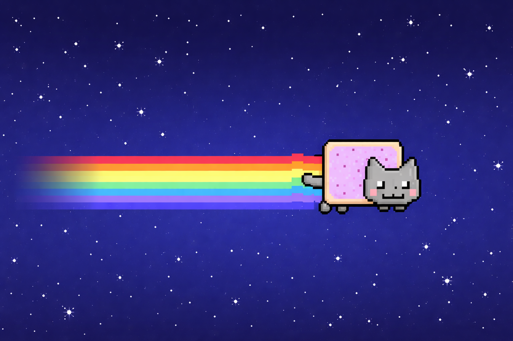

# 🐱🌈 Nyan Cat — Canvas v3



A **pixel‑perfect Nyan Cat animation** built with **HTML5 Canvas**, focused on visual accuracy, clean code, and retro vibes.

This version intentionally keeps the rainbow trail **simple and stable**, enhanced with a subtle **fade‑in** effect for a smoother, more authentic look.

---

## ✨ Features

* 🎮 **Pixel‑perfect rendering** (no smoothing, no sub‑pixel artifacts)
* 🐱 **Sprite‑sheet animation** for the cat
* 🌈 **Rainbow trail (tile‑based)** with clean horizontal repetition
* 🎨 **Subtle fade‑in on the trail** to avoid hard cutoffs
* ⭐ Retro **"+" pixel stars** on a solid blue background
* ⏯️ Pause / resume
* 📸 Screenshot capture
* 🧠 Clean, readable, hackable code

---

## 🧩 Assets

* **Cat sprite sheet**: `assets/nyan_sheet.png`

  * Format: `64×32` (or `32×32`) frames
  * Single row
* **Rainbow tile**: `assets/rainbow_tile.png`

  * Small seamless tile, repeated only on X
  * No vertical repetition

> The rainbow trail uses an **offscreen canvas** to apply the fade without affecting the background.

---

## 🌈 Rainbow Modes

* **sprite** → uses the rainbow already embedded in the cat sprite
* **tile** → draws a separate scrolling rainbow trail (recommended)
* **off** → disables the trail entirely

You can switch modes directly in the UI.

---

## 🚀 Run locally (no build)

```bash
npx serve .
# or
npx http-server . -p 8080
```

---

## ⚡ Run with Vite (dev mode)

```bash
npm install
npm run dev
```

Default port: **3000**

To change it:

```json
"dev": "vite --port 8080"
```

---

## 🧠 Technical Notes

* Rainbow repetition is done **manually on X** (`drawImage` loop)
* Fade is applied using `destination-in` **only on an offscreen canvas**
* All draw coordinates are **rounded to integers** for crisp pixels
* No shaders, no WebGL — just good old Canvas 2D ❤️

---

## 🎯 Goals of this project

* Stay visually close to the **original Nyan Cat / Construct feel**
* Keep the implementation **simple, understandable, and extensible**
* Provide a clean base for experiments (effects, music sync, variations)

---

## 📜 License

### Code

All original source code in this repository is licensed under the **MIT License**.

You are free to use, modify, and distribute the code, including for commercial purposes, provided that the copyright notice and permission notice are included.

### Assets (Important)

The **Nyan Cat sprite** used in this project is **not** covered by the MIT License.

* **Source project**: [https://github.com/DanOpcode/skuttande-nyan-cat](https://github.com/DanOpcode/skuttande-nyan-cat)
* **Author**: DanOpcode
* **File used**: `sprites/nyan-cat.png`
* **License**: Creative Commons Attribution-ShareAlike 3.0 Unported (CC BY-SA 3.0)
  [https://creativecommons.org/licenses/by-sa/3.0/](https://creativecommons.org/licenses/by-sa/3.0/)

Any modified versions of this sprite remain under the same **CC BY-SA 3.0** license.

All rights to the original Nyan Cat character belong to their respective creators.

---

✨ Have fun hacking it, remixing it, or turning it into something weird.
